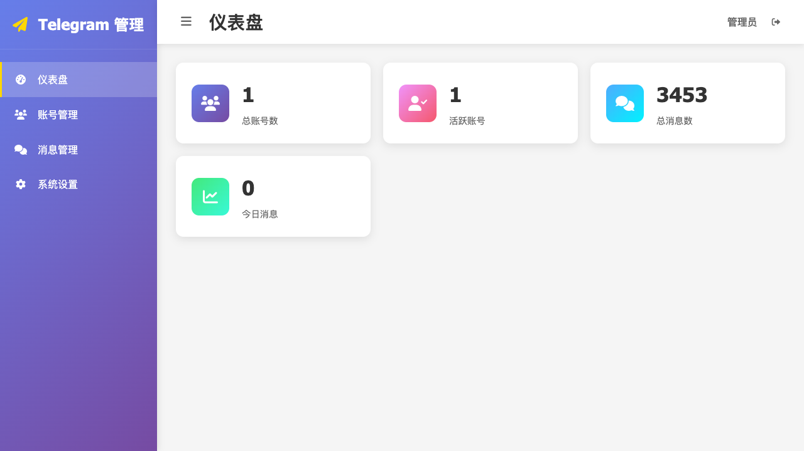
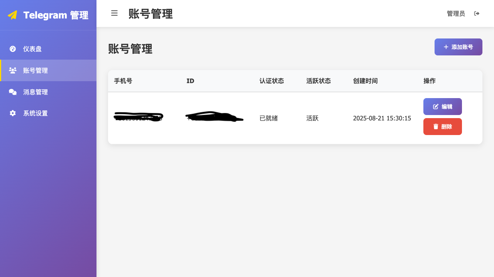
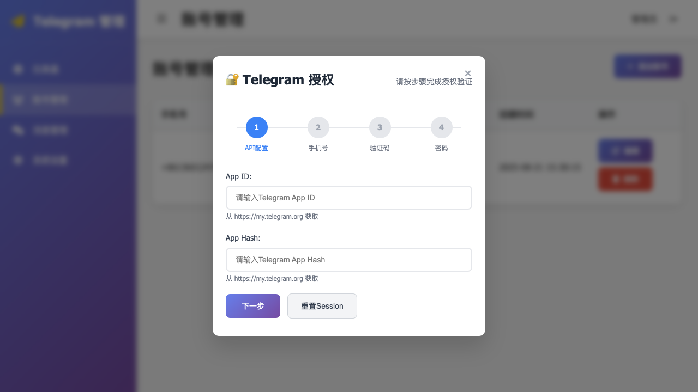
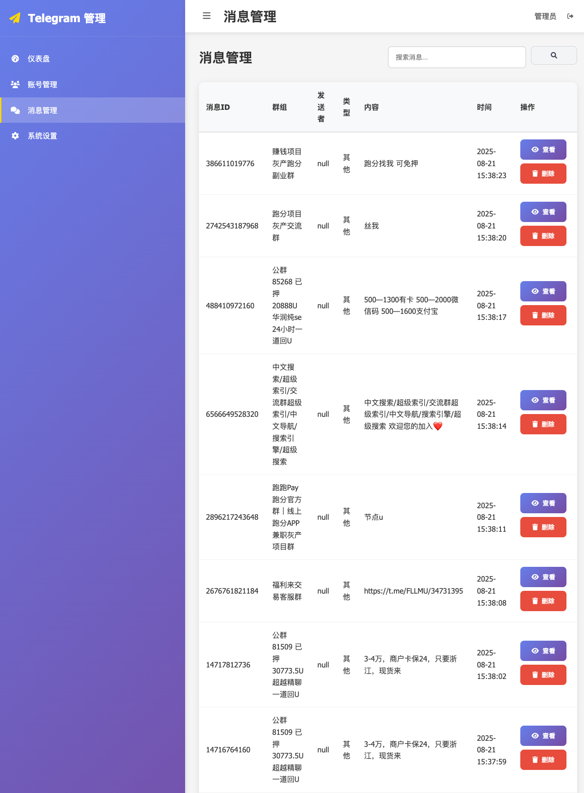
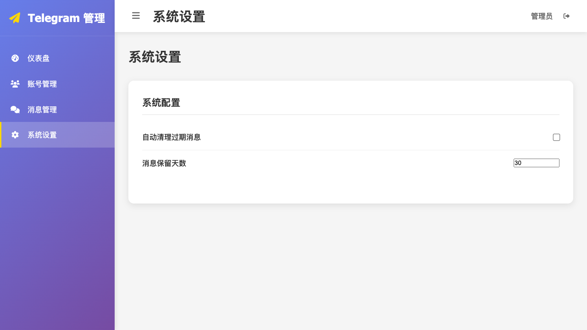

# Magic Telegram Server

一个基于Spring Boot和TDLight-Java的Telegram单账户消息实时监听服务。


## 功能特性

- 🚀 基于Spring Boot 3.2.0构建
- 📱 使用TDLight-Java 3.4.0+td.1.8.26版本
- 👤 单账户管理和认证
- 🔄 实时监听Telegram群组消息
- 🌐 支持SOCKS5代理访问
- 📝 消息实时写入到MongoDB进行持久化
- 🔐 自动会话管理和持久化
- 💾 **GridFS智能存储** - 基于MongoDB GridFS的高效Session存储方案
- 🗜️ **数据压缩优化** - 自动GZIP压缩，节省存储空间
- 🔒 **数据完整性校验** - SHA256哈希校验确保数据安全
- ⚡ **智能存储策略** - 根据数据大小自动选择最优存储方式
- 🐳 **Docker支持** - 提供完整的Docker部署方案，支持内置和外部MongoDB
- 🎯 完整的功能闭环：账户创建 → Session流程 → 消息监听

## 系统要求

### 🐳 Docker部署
- Docker 20.0+
- Docker Compose 2.0+ (可选)
- macOS/Linux/Windows
- 网络代理（用于访问Telegram服务器）

### 🔧 本地开发部署
- Java 17+
- Maven 3.6+
- MongoDB 4.0+ (用于GridFS存储)
- macOS/Linux/Windows
- 网络代理（用于访问Telegram服务器）

## 配置说明


### 代理配置
- 类型: SOCKS5
- 地址: 127.0.0.1
- 端口: 7890

### Session存储配置
- 存储策略: GridFS (MongoDB)
- 压缩算法: GZIP
- 分片阈值: 8MB
- 完整性校验: SHA256

## 快速开始

本项目支持两种部署方式：

### 🐳 Docker部署（推荐）

使用Docker可以快速部署，无需配置Java和Maven环境。详细的Docker部署指南请参考：

📖 **[Docker部署指南](docs/DOCKER_GUIDE.md)**

快速启动命令：
```bash
# 使用内置MongoDB（适合开发和测试）
docker run -d \
  --name magic-telegram \
  -p 8080:8080 \
  -e PROXY_HOST=host.docker.internal \
  -e PROXY_PORT=7890 \
  your-dockerhub-username/magic-telegram-server:latest

# 启动后访问 http://localhost:8080/api/admin/index.html
# 通过Web管理界面配置Telegram API和其他设置
```

### 🔧 本地开发部署

#### 1. 编译项目
```bash
mvn clean compile -s settings.xml
```

#### 2. 运行应用
```bash
mvn spring-boot:run -s settings.xml
```

#### 3. 使用Web管理系统
通过浏览器访问 `http://localhost:8080/api/admin/index.html` 使用可视化界面完成账户创建、认证和消息监听等所有操作。

## Web管理系统

本项目提供了一个功能完整的Web管理系统，可通过浏览器访问 `http://localhost:8080/api/admin/index.html` 进行可视化管理。

### 管理系统功能

#### 1. 仪表盘
管理系统主页提供了系统状态概览和快速操作入口。



#### 2. 账号管理
提供完整的Telegram账号管理功能：
- 账号创建和删除
- API配置管理
- 认证状态查看
- Session管理



**添加账号功能**：
支持通过弹窗形式添加新的Telegram账号，包括API配置和认证流程。



#### 3. 消息管理
实时查看和管理Telegram消息：
- 消息历史记录
- 消息搜索和过滤
- 消息状态监控



#### 4. 系统设置
系统配置和参数管理：
- 代理设置
- 存储配置
- 日志级别设置
- 系统监控



### 管理系统特性

- 🎨 **现代化UI设计** - 基于Bootstrap的响应式界面
- 🔐 **安全认证** - 内置认证机制，保护管理功能
- 📱 **移动端适配** - 支持手机和平板设备访问
- ⚡ **实时更新** - 状态信息实时刷新
- 🛠️ **操作便捷** - 一键式操作，简化管理流程

### 访问方式

启动应用后，通过以下URL访问管理系统：
```
http://localhost:8080/api/admin/index.html
```


## 项目结构

```
magic-telegram-server/
├── src/
│   ├── main/
│   │   ├── java/com/telegram/server/
│   │   │   ├── MagicTelegramServerApplication.java  # 主入口
│   │   │   ├── config/                             # 配置类
│   │   │   │   ├── AsyncConfig.java                # 异步配置
│   │   │   │   ├── GridFSConfig.java               # GridFS配置
│   │   │   │   ├── MessageStorageConfig.java       # 消息存储配置
│   │   │   │   ├── TelegramConfig.java             # Telegram配置
│   │   │   │   ├── TelegramConfigManager.java      # Telegram配置管理器
│   │   │   │   └── WebMvcConfig.java               # Web MVC配置
│   │   │   ├── controller/                         # 控制器层
│   │   │   │   ├── TelegramController.java         # Telegram REST控制器
│   │   │   │   ├── WebAdminController.java         # Web管理控制器
│   │   │   │   ├── MessageStorageTestController.java # 消息存储测试控制器
│   │   │   │   └── admin/                          # 管理后台控制器
│   │   │   ├── dto/                                # 数据传输对象
│   │   │   │   ├── AccountDTO.java                 # 账户DTO
│   │   │   │   ├── MessageDTO.java                 # 消息DTO
│   │   │   │   ├── PageRequestDTO.java             # 分页请求DTO
│   │   │   │   ├── PageResponseDTO.java            # 分页响应DTO
│   │   │   │   └── SystemStatsDTO.java             # 系统统计DTO
│   │   │   ├── entity/                             # 实体类
│   │   │   │   ├── TelegramMessage.java            # Telegram消息实体
│   │   │   │   └── TelegramSession.java            # Telegram会话实体
│   │   │   ├── lifecycle/                          # 生命周期管理
│   │   │   │   └── ApplicationLifecycleManager.java # 应用生命周期管理器
│   │   │   ├── monitor/                            # 监控组件
│   │   │   │   └── MessageStorageMonitor.java      # 消息存储监控器
│   │   │   ├── repository/                         # 数据访问层
│   │   │   │   ├── TelegramMessageRepository.java  # 消息仓库
│   │   │   │   └── TelegramSessionRepository.java  # 会话仓库
│   │   │   ├── service/                            # 服务层
│   │   │   │   ├── ITelegramService.java           # Telegram服务接口
│   │   │   │   ├── ITelegramSessionService.java    # 会话服务接口
│   │   │   │   ├── ITelegramMessageService.java    # 消息服务接口
│   │   │   │   ├── gridfs/                         # GridFS服务
│   │   │   │   │   ├── GridFSService.java          # GridFS核心服务
│   │   │   │   │   ├── GridFSStorageManager.java   # GridFS存储管理器
│   │   │   │   │   ├── GridFSCompressionService.java # GridFS压缩服务
│   │   │   │   │   ├── GridFSIntegrityService.java # GridFS完整性服务
│   │   │   │   │   └── GridFSIntegrityChecker.java # GridFS完整性检查器
│   │   │   │   └── impl/                           # 服务实现
│   │   │   │       ├── TelegramServiceImpl.java   # Telegram服务实现
│   │   │   │       ├── TelegramSessionServiceImpl.java # 会话服务实现
│   │   │   │       └── TelegramMessageServiceImpl.java # 消息服务实现
│   │   │   ├── storage/                            # 存储相关
│   │   │   │   ├── exception/                      # 存储异常
│   │   │   │   ├── monitor/                        # 存储监控
│   │   │   │   ├── strategy/                       # 存储策略
│   │   │   │   └── util/                           # 存储工具
│   │   │   └── util/                               # 工具类
│   │   │       ├── ImageProcessingUtil.java       # 图片处理工具
│   │   │       ├── PathValidator.java             # 路径验证工具
│   │   │       ├── RetryHandler.java              # 重试处理器
│   │   │       └── TimeZoneUtil.java              # 时区工具
│   │   └── resources/                              # 资源文件
│   │       ├── application.yml                     # 主配置文件
│   │       └── static/                             # 静态资源
│   │           └── admin/                          # 管理后台前端
│   │               ├── index.html                 # 管理后台主页
│   │               ├── css/                       # 样式文件
│   │               │   ├── admin.css              # 管理后台样式
│   │               │   └── auth-modal.css         # 认证弹窗样式
│   │               └── js/                        # JavaScript文件
│   │                   ├── admin.js               # 管理后台主脚本
│   │                   ├── api.js                 # API调用脚本
│   │                   ├── components.js          # 组件脚本
│   │                   ├── utils.js               # 工具脚本
│   │                   └── components/            # 组件目录
│   │                       └── auth-modal.js      # 认证弹窗组件
│   └── test/                                       # 测试代码
│       ├── java/                                   # Java测试
│       └── resources/                              # 测试资源
│           └── application-test.yml                # 测试配置
├── docs/                                           # 文档目录
├── pom.xml                                         # Maven配置
├── LICENSE                                         # 许可证文件
└── readme.md                                       # 项目说明
```

## 功能闭环说明

本项目实现了完整的单账户Telegram消息监听功能闭环：

### 1. 单账户创建
- 通过 `/telegram/account/create` 接口初始化账户
- 重置所有运行时配置，准备新的认证流程
- 支持重复创建，自动清理旧的客户端连接

### 2. Session流程
- **API配置**: 设置Telegram API ID和Hash
- **手机号认证**: 提交手机号码，接收验证码
- **验证码验证**: 提交短信验证码进行验证
- **密码验证**: 如开启两步验证，需提交密码
- **Session持久化**: 认证成功后自动保存会话信息
- **智能存储**: 根据数据大小自动选择GridFS或传统存储方式
- **数据压缩**: 大于8MB的数据自动进行GZIP压缩
- **完整性校验**: 使用SHA256哈希确保数据完整性

### 3. 消息监听
- 认证完成后可启动实时消息监听
- 支持群组消息的实时接收和处理
- 消息内容实时输出到控制台日志
- 支持启动/停止监听控制

## 注意事项

1. **代理设置**: 确保SOCKS5代理服务正常运行在127.0.0.1:7890
2. **MongoDB服务**: 确保MongoDB 4.0+服务正常运行，用于GridFS存储
3. **会话持久化**: 认证成功后会在MongoDB中保存会话信息，支持GridFS大文件存储
4. **存储策略**: 系统自动根据数据大小选择存储方式，大于8MB使用GridFS
5. **数据压缩**: 大文件自动进行GZIP压缩，节省存储空间
6. **群组权限**: 确保Telegram账号已加入需要监听的群组
7. **网络连接**: 需要稳定的网络连接和代理服务
8. **单账户模式**: 系统只支持单个账户，创建新账户会清理旧账户数据

## 故障排除

### 连接问题
- 检查代理服务是否正常运行
- 确认代理端口配置正确
- 验证网络连接状态

### 认证问题
- 确认API ID和Hash正确
- 检查手机号格式（需包含国家代码）
- 验证验证码输入是否正确
- 如有两步验证，确保密码正确

### Session问题
- 如认证失败，可使用 `/telegram/session/clear` 清理Session数据
- 清理后需重新进行完整认证流程
- Session数据存储在MongoDB中，支持GridFS大文件存储
- 检查MongoDB连接状态和GridFS配置

### 存储问题
- 确认MongoDB服务正常运行
- 检查GridFS存储空间是否充足
- 验证数据压缩和完整性校验功能
- 查看存储策略配置是否正确

### 依赖问题
- 清理Maven缓存: `mvn clean`
- 重新下载依赖: `mvn dependency:resolve`
- 检查TDLight依赖是否正确下载
- 确认Java版本为17+

## 使用示例

### 🐳 Docker部署示例

```bash
# 1. 使用Docker快速启动（推荐）
docker run -d \
  --name magic-telegram \
  -p 8080:8080 \
  -e PROXY_HOST=host.docker.internal \
  -e PROXY_PORT=7890 \
  your-dockerhub-username/magic-telegram-server:latest

# 2. 打开Web管理系统
# 在浏览器中访问: http://localhost:8080/api/admin/index.html
# 通过可视化界面完成账户创建、API配置、认证和消息监听等操作
```

> **注意**: Telegram API配置（API_ID和API_HASH）无需在环境变量中设置，完全通过Web管理界面进行配置。

### 🔧 本地开发示例

```bash
# 1. 启动应用
mvn spring-boot:run

# 2. 打开Web管理系统
# 在浏览器中访问: http://localhost:8080/api/admin/index.html
# 通过可视化界面完成账户创建、API配置、认证和消息监听等操作
```


## 版本历史


### v1.2.1 (2025-01-15)
- 🔧 **多平台支持优化**: 修复了仅支持macOS的问题
- 🐧 **Linux支持**: 添加了Linux x86_64 (GNU GCC + OpenSSL 1.x)原生库支持
- 🪟 **Windows支持**: 添加了Windows x86_64原生库支持
- 📦 **TDLight原生库**: 完善了跨平台TDLight原生库依赖配置
- 🐳 **Docker优化**: 修复了Docker环境下TDLight原生库加载问题

### v1.1.0 (2025-08-05)
- 💾 **GridFS智能存储**: 基于MongoDB GridFS的高效Session存储方案
- 🗜️ **数据压缩优化**: 自动GZIP压缩，节省存储空间
- 🔒 **数据完整性校验**: SHA256哈希校验确保数据安全
- ⚡ **智能存储策略**: 根据数据大小自动选择最优存储方式

## 作者

- **作者**: liubo
- **日期**: 2025-01-15
- **版本**: 1.2.1 (多平台支持版)

## 许可证

本项目基于 [Apache License 2.0](LICENSE) 开源协议发布。

```
Copyright 2025 liubo

Licensed under the Apache License, Version 2.0 (the "License");
you may not use this file except in compliance with the License.
You may obtain a copy of the License at

    http://www.apache.org/licenses/LICENSE-2.0

Unless required by applicable law or agreed to in writing, software
distributed under the License is distributed on an "AS IS" BASIS,
WITHOUT WARRANTIES OR CONDITIONS OF ANY KIND, either express or implied.
See the License for the specific language governing permissions and
limitations under the License.
```